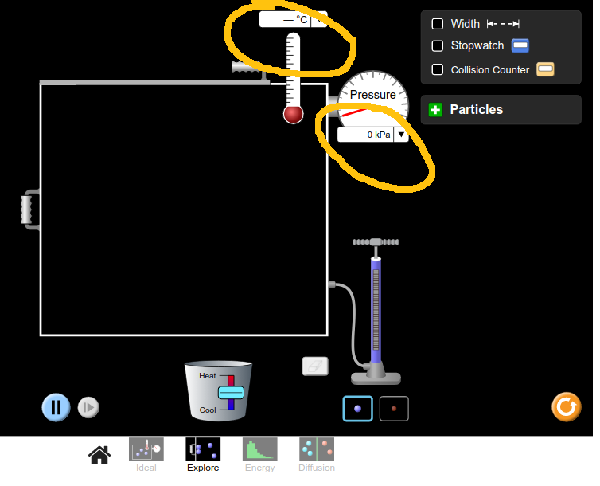
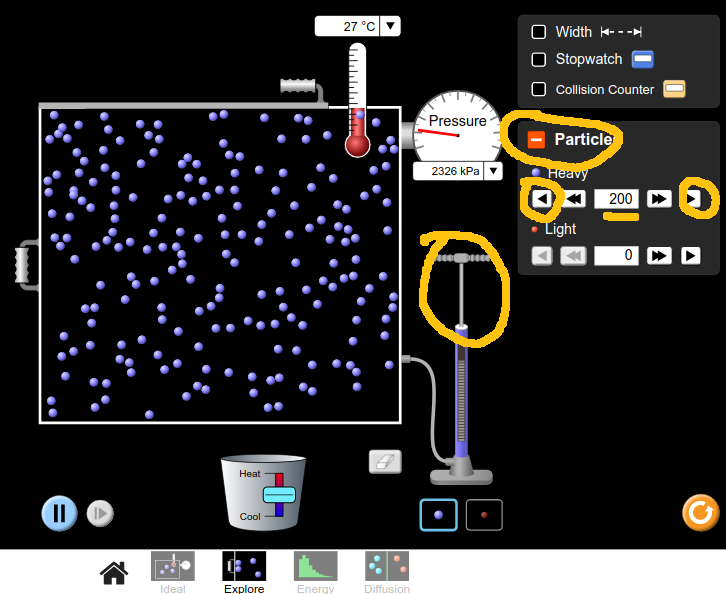
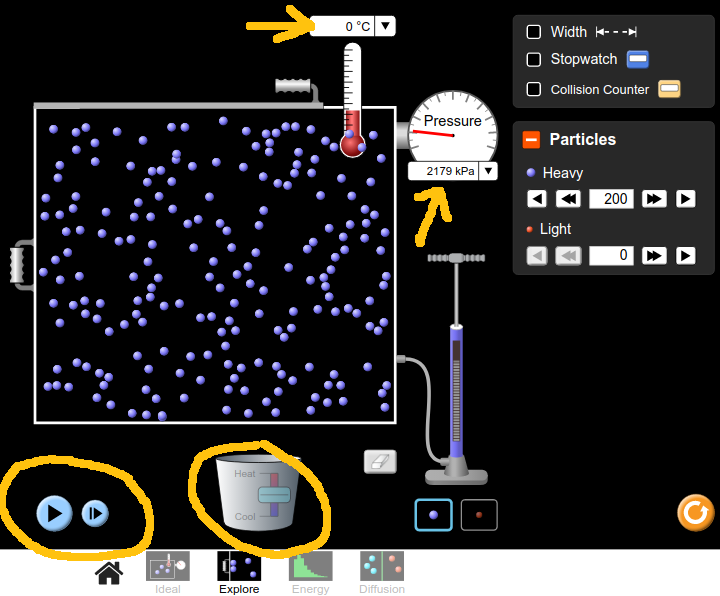
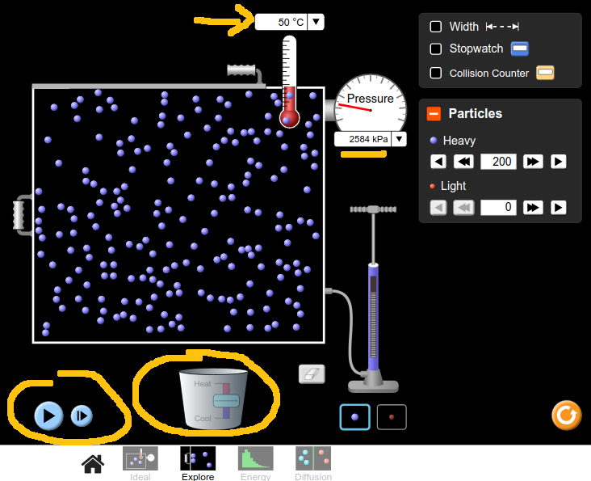

<style>
body {
  font-family: cursive;
  line-height: 1.4;
  font-weight: normal;
  font-stretch: normal;
  font-size: 20px;
  color: darkblue;
}

</style>

```{r setup, include=FALSE}
knitr::opts_chunk$set(echo = FALSE, warning = F, message = F)
```

## Theory
This experiment sets out to prove the ideal gas law, $PV\:=\:nRT$. It will provide a value for the absolute zero of temperature, and it will measure the gas constant, $R$.

## Set-Up and Results

Go to the gas properties experiment on the [PHET website](https://phet.colorado.edu/sims/html/gas-properties/latest/gas-properties_en.html). Choose the **Explore** option. When this simulation opens up, there are a number of changes to be made: 

1. Adjust the scales on the thermometer and pressure gauge to be in $^{\circ}$C and kPa respectively  
<br>  

<br>  
2. Click on the green plus sign beside _Particles_ and use the pump to inject 200 particles in to the box. You can fine tune the number with the play and rewind buttons.   
<br>  

<br>
3. Use the slider bar on the bucket below the box to adjust the temperature to 0$^{\circ}$C. Then stop the animation with the blue pause button bottom left, and record the pressure from the pressure gauge.  
<br>  

<br>  
4. Now launch the simulation again by pressing that blue button, increase the temperature to 50$^{\circ}$C, pause it and record the new pressure.  
<br>  

<br>  
5. Keep doing this, in steps of 50$^{\circ}$C, until you get to 300$^{\circ}$C.  
6. Then repeat the whole process with 300 particles, and then again with 400 particles   
<br>  
<br>  

## Table
  
Fill out a table as shown below. A handful of my pressure measurements have been included just to give you an idea of the kind of figures to expect, you should replace these pressure values with your own which are more accurate.  
<br>  
```{r libraries}
library(tidyverse)
library(ggpubr)
library(wesanderson)
library(gt)
```

```{r data}
z <- tibble(T = seq(0, 300, by=50), 
            P200 = c(2178, 2530, 2950, 3360, 3714, 4125, 4554),
            P300 = c(3272, 3793, 4427, 4993, 5619, 6215, 6783),
            P400 = c(4345, 5097, 5868, 6671, 7456, 8246, 9014),
            P200_empty = rep("", 7),
            P300_empty = rep("", 7),
            P400_empty = rep("", 7)) 

z$P200_empty[1] <- 2178
z$P200_empty[2] <- 2530
z$P300_empty[4] <- 4993
z1 <- z %>%
  select(-c(P200_empty, P300_empty, P400_empty)) %>% 
  pivot_longer(cols = -T, names_to = "particles", values_to = "pressures")
```

```{r}
z %>% 
  select(-c(P200, P300, P400)) %>% 
  gt() %>% 
  cols_label(T = md("**Temperature(°C)**"),
             P200_empty = md("**200 Particles**"),
             P300_empty = md("**300 Particles**"),
             P400_empty = md("**400 Particles**")) %>% 
  cols_align(align = "center") %>%   
  tab_spanner(
    label = "Pressure (kPa)",
    columns = vars(P200_empty, P300_empty, P400_empty)
  ) %>% 
  tab_options(column_labels.background.color = "cornflowerblue", 
              table.font.names = "Caveat",
              table.font.style = "oblique",
              column_labels.font.weight = "bold",
              column_labels.vlines.width = 1,
              column_labels.vlines.color = "darkblue",
              column_labels.vlines.style = "solid",
              table_body.vlines.width = 1,
              table_body.vlines.color = "darkblue",
              table_body.vlines.style = "solid"
  ) %>% 
  tab_style(
    style = list(
      cell_fill(color = "#eeeeee")
    ),
    locations = cells_body(rows = seq(2, 7, by=2))
  )
```
<br>
<br>

## Graph  
Plot a graph of pressure versus temperature giving three separate lines, one for each of 200 / 300 / 400 particles. Also, make sure the x-axis goes back as far as -350$^{\circ}$C and that the y-axis goes to zero. It should look a little like the graph sketched below.

```{r graph}
pal <- wes_palette("Moonrise3", n = 3)

z1 %>% ggplot(aes(T, pressures, col = particles)) + 
  geom_point(size = 5, show.legend = F, shape = 1) + 
  geom_point(show.legend = F) + 
  geom_smooth(method = "lm", fullrange = T, se = F, show.legend = F) + 
  stat_regline_equation(label.y = c(4000, 6000, 8000), 
                        output.type = "latex",
                        show.legend = F) +
  labs(title = "Pressure vs Temperature\nfor an Ideal Gas",
       x = "T(°C)",
       y = "P(kPa)") + 
  scale_colour_manual(values = pal) +
  scale_x_continuous(breaks = seq(-300, 300, by=100),
                     minor_breaks = waiver(), 
                     limits = c(-350, 350)) + 
  annotate("text", x=-50, y=-270, 
           label = "-273.15°C",
           col = "red",
           hjust = "right",
           vjust = "top",
           fontface = 2,
           family = "Ink Free") + 
  annotate("segment", 
           x = -180, xend = -260, 
           y = -200, yend = -25, 
           colour = "red", 
           size=2, alpha=0.6, 
           arrow=arrow()) +
  annotate("text", y = c(3500, 7000, 8000), 
           x = c(280, 270, 180), 
           label = c("N = 200", "N = 300", "N = 400"),
           col = pal,
           hjust = "right",
           vjust = "top",
           fontface = 2,
           family = "Ink Free") + 
  theme_minimal() + 
  theme(text = element_text(family = "Ink Free", size = 18),
        plot.title = element_text(size = 32))

```

Calculate the slope of each of the three lines.

## Analysis

If you get straight lines for the three sets of results, then your results are consistent with the ideal gas law.  

_Absolute Zero_: the temperature where the three lines come together, cutting the x-axis where the pressure is 0Pa, gives an estimate of absolute zero of temperature.

_Gas Constant, R_: For each line, estimate a value for __R__ as follows - 
$$R\:=\:207.9\div N\times slope$$  
where N is the number of particles (200, 300, or 400) and $slope$ is the slope of that line.

## Discussion

The reference value for absolute zero of temperature is -273.15$^{\circ}$C. The reference value for R is 8.314 J/kg/mol.
